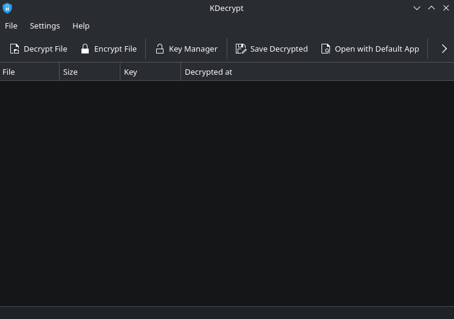

<p align="center">
  
</p>

<h1 align="center">KDecrypt</h1>

<p align="center">
  A KDE Plasma application for encrypting, decrypting, and managing PGP/GPG files and keys.
</p>

<p align="center">
  <a href="https://github.com/Guid-Lab/kdecrypt/actions"></a>
  <a href="LICENSES/GPL-3.0-or-later.txt"></a>
  
  
</p>

<p align="center">
  
</p>

## Features

- Decrypt `.pgp`, `.gpg`, `.asc` encrypted files
- Encrypt files for multiple recipients with optional signing
- Full GPG key management (generate, import, export, delete)
- Passphrase storage via KDE Wallet
- Drag-and-drop support for quick file decryption
- Open decrypted files with default applications
- Remember encrypted files between sessions
- Switchable interface language
- Built-in handbook (English, Polish)

## Security

KDecrypt is designed with security in mind:

- **In-memory AES-256-GCM encryption** — decrypted file contents are stored in memory using authenticated encryption with a random key generated at startup; protects against memory dumps and swap file leaks
- **Secure wiping** — decrypted data buffers are overwritten with zeros before being freed
- **No temporary files** — decrypted data is never written to disk unless you explicitly save it
- **Safe passphrase handling** — passphrases are passed to GPG via file descriptor, never via command-line arguments

## Dependencies

### Build

- CMake >= 3.20
- Qt 6 (Core, Gui, Widgets)
- KDE Frameworks 6: CoreAddons, I18n, XmlGui, WidgetsAddons, Wallet, DBusAddons, WindowSystem, DocTools
- Extra CMake Modules (ECM)
- OpenSSL
- gettext

### Runtime

- GnuPG (`gpg`)
- KDE Wallet (`kwallet`)
- KHelpCenter (for the built-in handbook)

### Arch Linux / CachyOS

```bash
sudo pacman -S cmake extra-cmake-modules qt6-base qt6-tools \
  kcoreaddons ki18n kxmlgui kwidgetsaddons kwallet kdbusaddons \
  kwindowsystem kdoctools openssl gettext

sudo pacman -S gnupg kwallet khelpcenter
```

### Debian / Ubuntu

```bash
sudo apt install cmake extra-cmake-modules qt6-base-dev \
  qt6-tools-dev libkf6coreaddons-dev libkf6i18n-dev \
  libkf6xmlgui-dev libkf6widgetsaddons-dev \
  libkf6wallet-dev libkf6dbusaddons-dev libkf6windowsystem-dev \
  libkf6doctools-dev libssl-dev gettext

sudo apt install gnupg kwalletmanager khelpcenter
```

### Fedora

```bash
sudo dnf install cmake extra-cmake-modules qt6-qtbase-devel \
  qt6-qttools-devel kf6-kcoreaddons-devel kf6-ki18n-devel \
  kf6-kxmlgui-devel kf6-kwidgetsaddons-devel \
  kf6-kwallet-devel kf6-kdbusaddons-devel kf6-kwindowsystem-devel \
  kf6-kdoctools-devel openssl-devel gettext

sudo dnf install gnupg2 kf6-kwallet khelpcenter
```

## Building

```bash
cmake -B build -DCMAKE_BUILD_TYPE=Release -DCMAKE_INSTALL_PREFIX=/usr
cmake --build build
```

## Installing

```bash
sudo cmake --install build
```

## Usage

Launch KDecrypt from the application menu or run `kdecrypt` from the terminal.

| Shortcut | Action |
|----------|--------|
| Ctrl+O | Decrypt file |
| Ctrl+E | Encrypt file |
| Ctrl+K | Key Manager |
| Ctrl+S | Save decrypted file |
| Return | Open with default app |
| Delete | Remove from list |
| F1 | Open handbook |

You can also associate `.pgp`/`.gpg` files with KDecrypt in Dolphin for one-click decryption, or drag encrypted files directly onto the window.

## License

This project is licensed under the [GPL-3.0-or-later](LICENSES/GPL-3.0-or-later.txt).

REUSE-compliant. See [REUSE](https://reuse.software/) for details.

## Contributing

Report bugs and feature requests at [github.com/Guid-Lab/kdecrypt/issues](https://github.com/Guid-Lab/kdecrypt/issues).
